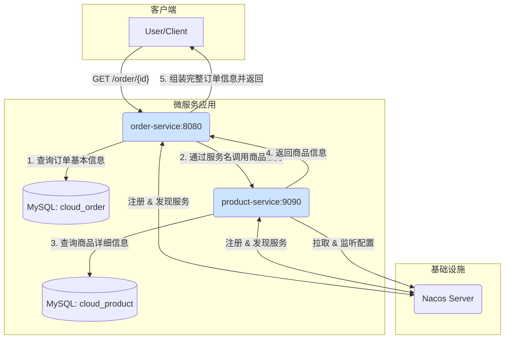

# 🚀 Spring Cloud Nacos 微服务实践项目


这是一个基于 Spring Cloud 和 Spring Cloud Alibaba 的微服务入门项目，旨在演示如何使用 Nacos 作为服务注册发现中心和配置中心。项目包含两个核心服务：`order-service` (订单服务) 和 `product-service` (商品服务)。

## ✨ 项目核心功能

* **微服务架构**：项目被拆分为 `order-service` 和 `product-service` 两个独立的服务，每个服务都有自己的职责和数据库。
* **服务注册与发现**：所有服务都注册到 Nacos 注册中心，使得服务之间可以通过服务名进行通信，而不是依赖硬编码的 IP 地址。
* **客户端负载均衡**：订单服务通过一个带有 `@LoadBalanced` 注解的 `RestTemplate` 来调用商品服务，Nacos 会自动进行负载均衡。
* **分布式配置管理**：`product-service` 演示了如何从 Nacos 配置中心拉取配置，并使用 `@RefreshScope` 注解实现配置的动态热更新。
* **多环境配置**：项目通过 Maven Profiles (`dev` 和 `prod`) 来管理不同环境（开发/生产）的配置，例如数据库连接和 Nacos 地址。

## 🔧 技术栈

| 技术                  | 版本/说明                                      |
| --------------------- | ---------------------------------------------- |
| **Java** | `17`                                         |
| **Spring Boot** | `3.1.6`                                        |
| **Spring Cloud** | `2022.0.3`                                      |
| **Spring Cloud Alibaba** | `2022.0.0.0-RC2`                           |
| **数据库** | `MySQL 8.0.33`                                |
| **持久层框架** | `MyBatis 3.0.3`                               |
| **构建工具** | `Maven`                                        |

## 🏗️ 架构图



## 📚 模块说明

### 📦 order-service
- **职责**: 处理与订单相关的业务逻辑。
- **端口**: `8080`
- **应用名**: `order-service`
- **核心接口**:
  - `GET /order/{orderId}`: 根据订单ID查询订单详情。此接口会从自身数据库查询订单信息，然后通过 `RestTemplate` 远程调用 `product-service` 获取关联的商品信息。

### 📦 product-service
- **职责**: 处理与商品相关的业务逻辑，并演示 Nacos 配置管理。
- **端口**: `9090`
- **应用名**: `product-service`
- **核心接口**:
  - `GET /product/{productId}`: 根据商品ID查询商品详情。
  - `GET /getConfig`: 从 Nacos 配置中心读取 `nacos.config` 配置项的值，用于测试配置热更新。

## 💡 关键代码解析

#### 1. 服务调用与负载均衡 (`order-service`)
通过 `@LoadBalanced` 注解赋予 `RestTemplate` 负载均衡的能力，可以直接使用服务名 `product-service` 来代替具体的 IP 和端口。

*`BeanConfig.java`*
```java
@Configuration
public class BeanConfig {

    @LoadBalanced
    @Bean
    public RestTemplate restTemplate() {
        return new RestTemplate();
    }
}
```


*`OrderService.java`*
```java
@Service
public class OrderService {
    @Autowired
    private RestTemplate restTemplate;

    @Autowired
    private OrderMapper orderMapper;

    public OrderInfo selectOrderById(Integer orderId){
        OrderInfo orderInfo = orderMapper.selectOrderById(orderId);
        // 直接使用服务名发起请求
        String url = "http://product-service/product/" + orderInfo.getProductId();
        ProductInfo template = restTemplate.getForObject(url, ProductInfo.class);
        orderInfo.setProductInfo(template);
        return orderInfo;
    }
}
```


#### 2. Nacos 动态配置 (`product-service`)
使用 `@RefreshScope` 注解，当 Nacos 控制台的配置发生变化时，相关 Bean 会被刷新，从而获取到最新的配置值，无需重启服务。

*`NacosController.java`*
```java
// 这个注解是配置的热更新
@RefreshScope
@RestController
public class NacosController {

    @Value("${nacos.config}")
    private String nacosConfig;

    @RequestMapping("/getConfig")
    public String getConfig(){
        return "从nacos获取配置项nacos.config" + nacosConfig;
    }
}
```


## 🚀 如何运行

1.  **环境准备**:
    - 安装 Java 17
    - 安装 Maven
    - 安装并启动 MySQL 数据库，并创建 `cloud_order` 和 `cloud_product` 两个库。
    - 下载并启动 Nacos Server。

2.  **修改配置**:
    - 根据你的环境，修改 `order-service` 和 `product-service` 中 `src/main/resources/` 目录下的 `application-dev.yml` 文件，更新 MySQL 和 Nacos 的地址、用户名和密码。

3.  **打包和运行**:
    - 在项目根目录下执行 Maven 命令进行打包：
      ```bash
      mvn clean package
      ```
    - 分别进入 `order-service/target` 和 `product-service/target` 目录，启动两个服务：
      ```bash
      # 启动订单服务 (使用 dev 配置)
      java -jar -Dspring.profiles.active=dev order-service-1.0-SNAPSHOT.jar

      # 启动商品服务 (使用 dev 配置)
      java -jar -Dspring.profiles.active=dev product-service-1.0-SNAPSHOT.jar
      ```

4.  **访问测试**:
    - 访问 Nacos 控制台（默认为 `http://localhost:8848/nacos`），查看服务是否都已成功注册。
    - 假设数据库中有 ID 为 1 的订单，并且该订单关联了商品，可以访问 `http://localhost:8080/order/1` 查看订单服务是否成功调用了商品服务并返回了完整信息。
